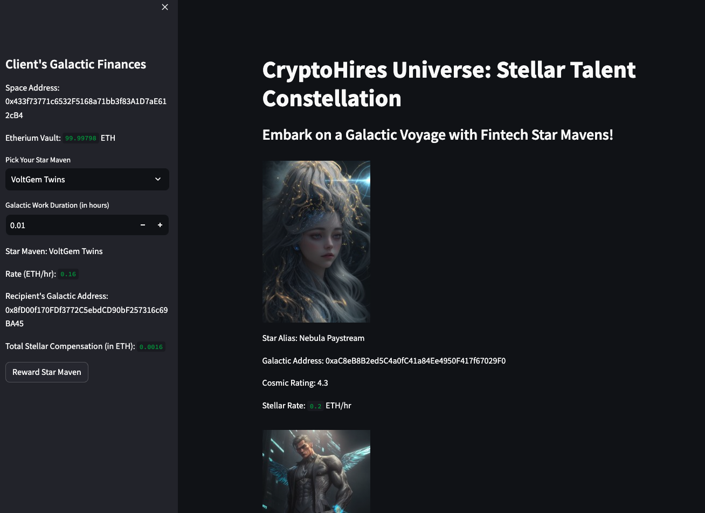
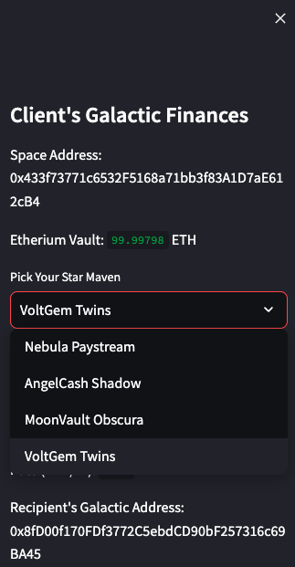
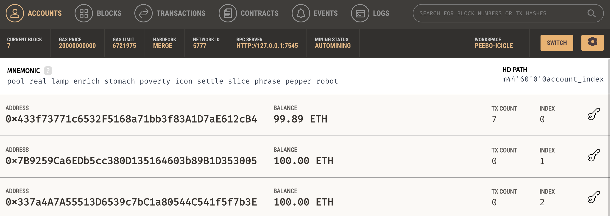
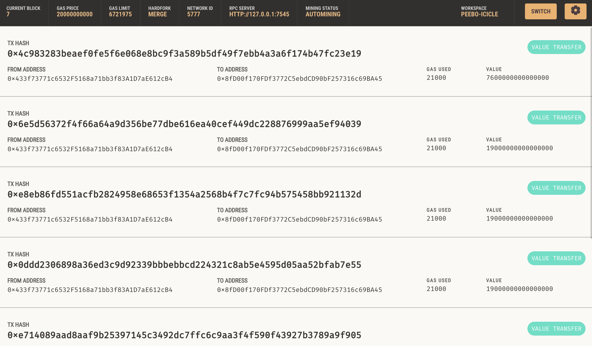
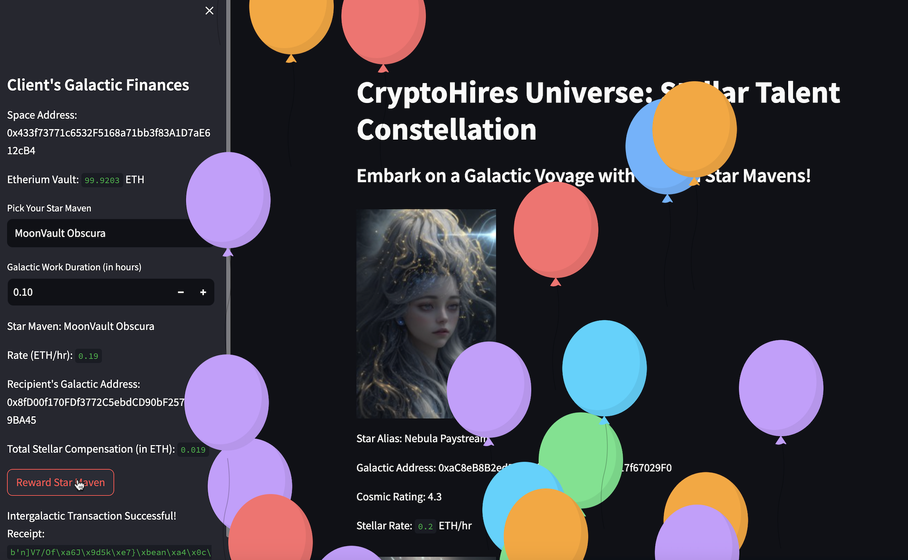

# 🌌 Galactic FinTech Fusion: CryptoHires 🌌

Welcome aboard the cosmic voyage of FinTech elegance, where the nebulae of fashion blend with the constellations of blockchain! CryptoHires is the brainchild of this celestial rendezvous, weaving the chic allure of haute couture with the intricate tapestry of cryptocurrency.

## 🌠 What is CryptoHires?

CryptoHires is the beacon in the interstellar void of mundane hiring platforms. It's where Ethereum's technological might meets the sophistication of a Milan fashion week. 

## 🛸 How Does it Navigate the Universe?

Harnessing the power of Python, CryptoHires steers its course through the vast blockchain space. At its core:

- It forges a digital wallet and an Ethereum account, the compass guiding our ship.
- This wallet charts our course in the Ethereum galaxy, tracing the path of transactions.

Key functionalities include:

- Account creation 🌟
- Fetching Ether balances for stardust spending 💫
- Facilitating Ether transactions across the universe 🌌

## 🌌 Who are the Luminaries Guiding Our Path?

The CryptoHires universe is illuminated by the most radiant fintech personas. Each with their Ethereum beacon, shining brightly with their unique rating and rate in Ether. They are:

- Nebula Paystream, the ethereal guide 🌙
- AngelCash Shadow, the guardian of elegance 🌒
- MoonVault Obscura, the silent sentinel 🌓
- VoltGem Twins Ledger, the twin stars of wisdom 🌔

## 🚀 Engaging with CryptoHires: A Celestial Ballet

The Streamlit interface of CryptoHires is a cosmic dance of stars and galaxies. Here, you can:

- Explore the profiles of our luminaries 🌍
- Engage a talent for your voyage 🚀
- Specify their mission duration ⏳
- Compensate them in Ether for their celestial guidance 💸

Once the universe acknowledges your transaction, a transaction hash will solidify your engagement. And as a cosmic nod to your endeavors, a galactic celebration awaits!

## 🪐 Embrace the Galactic Elegance of FinTech!

CryptoHires isn't just a platform. It's the symphony of the universe, a confluence of style and technology. So, don your space suits, embark on this astral journey, and let CryptoHires steer your ship through the FinTech galaxies!

🌌🌌🌌🌌🌌🌌🌌🌌🌌🌌🌌🌌🌌🌌🌌🌌🌌🌌🌌🌌🌌🌌🌌🌌🌌🌌🌌🌌🌌🌌🌌🌌🌌🌌🌌🌌🌌🌌🌌🌌🌌🌌🌌🌌🌌🌌🌌🌌🌌🌌🌌🌌🌌

## 🌠 Documenting Your Interstellar Engagements: A Guided Path

Once you've chosen your luminary and set their mission duration, it's time to compensate them. Here's how you can traverse this path and document the journey:

1. Activate the `Compensate Talent` constellation. This signs and sends the transaction, using the coordinates of your Ethereum compass. 🌠🚀

2. Next, plot your course to the `Transactions` nebula in Ganache. 🌌🔭

3. Capture a cosmic snapshot of your balance and history. This stardust will be a testament to your voyage. 📸✨

4. Preserve this snapshot in the `README.md` logbook of your GitHub space station. This beacon will guide fellow voyagers to your path. 📜🌠

5. Take another snapshot of the transaction details, capturing the essence of your journey. 📸🌍

6. Archive this in the same `README.md` logbook, completing the testament of your celestial engagement. 📜🌟

By following this astral guide, you etch your journey into the cosmos, letting the universe bear witness to your endeavors. Such is the beauty of blockchain's cosmic tapestry! 🌌🌠

🌌🌌🌌🌌🌌🌌🌌🌌🌌🌌🌌🌌🌌🌌🌌🌌🌌🌌🌌🌌🌌🌌🌌🌌🌌🌌🌌🌌🌌🌌🌌🌌🌌🌌🌌🌌🌌🌌🌌🌌🌌🌌🌌🌌🌌🌌🌌🌌🌌🌌🌌🌌🌌🌌🌌🌌🌌

---
